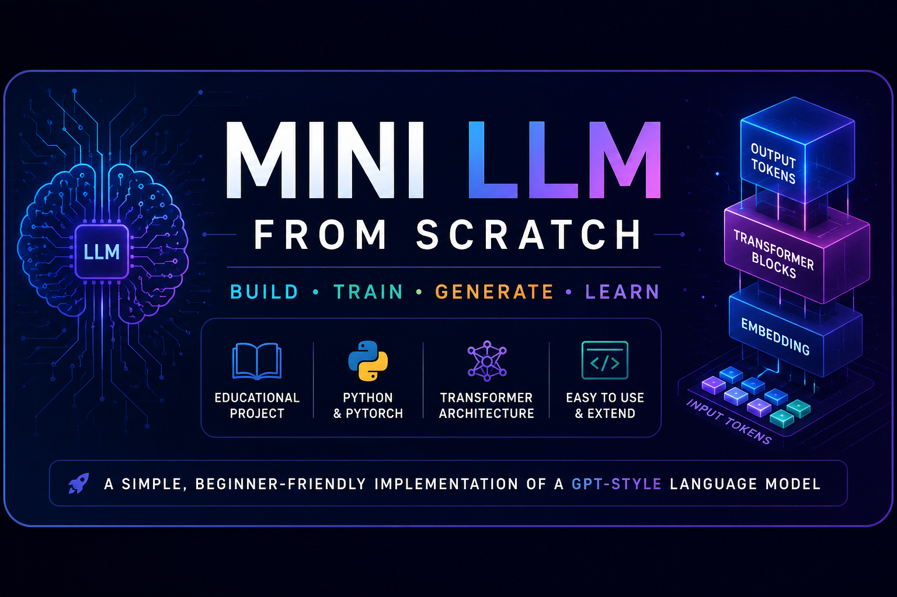
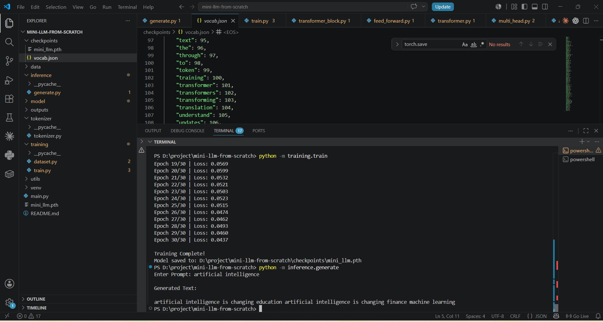
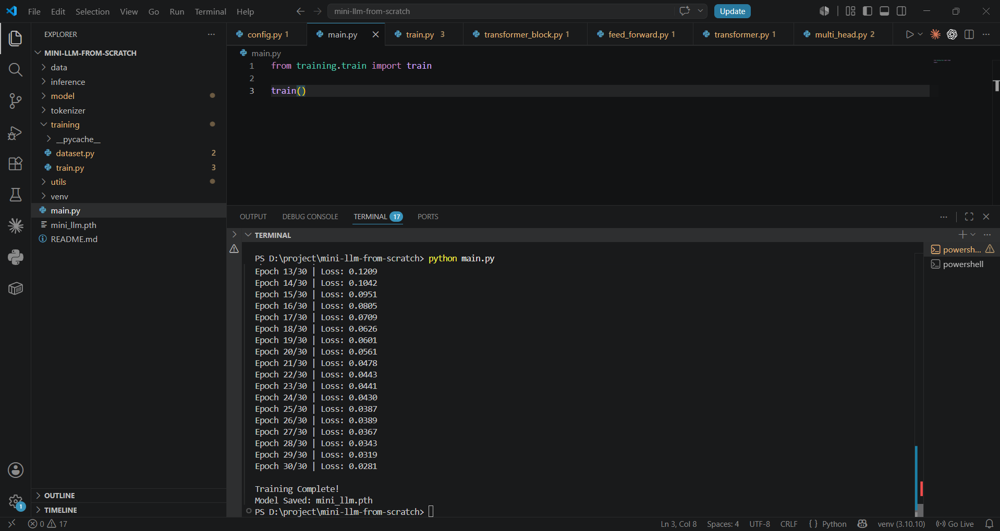

<p align="center">
  
</p>

<h1 align="center">🧠 Mini LLM From Scratch</h1>

<p align="center">
  <strong>Understand • Build • Train • Generate • Learn</strong>
</p>

<p align="center">
An educational implementation of a <strong>GPT-style Transformer Language Model</strong> built from scratch using <strong>Python</strong> and <strong>PyTorch</strong>.
</p>

<p align="center">


</p>

---

# 📖 Overview

Modern AI frameworks make it easy to use Large Language Models, but they often hide the concepts that matter most.

This project was created to better understand how **GPT-style Transformer language models** work by implementing their core components from scratch using Python and PyTorch.

Rather than relying on high-level model libraries, the project focuses on the fundamental building blocks behind modern language models, making it easier to explore how text is processed, how attention works, and how a model learns to generate the next token.

Whether you're a student, a beginner in Deep Learning, or someone curious about Transformer architectures, this repository is designed to provide a practical learning experience through clean, modular code.

---

# 🎓 Educational Notice

> [!NOTE]
> This is an educational project created for learning and experimentation.
>
> It intentionally simplifies many aspects of production-scale language models so that the core Transformer architecture can be understood more easily.
>
> The focus is on **clarity**, **modularity**, and **understanding**, rather than achieving state-of-the-art performance.

---

# ⭐ Why This Project?

There are many tutorials explaining **what Transformers are**, but comparatively few show **how to build one from scratch**.

The primary goal of this repository is to bridge that gap.

Instead of treating a language model as a black box, this project walks through the major building blocks that make GPT-style models possible.

By exploring the implementation, readers can understand:

- How raw text becomes numerical tokens
- How a vocabulary is created
- How embeddings represent words
- Why positional information is important
- How self-attention captures context
- How Transformer blocks process sequences
- How next-token prediction works
- How autoregressive text generation is performed

The emphasis is on learning through implementation rather than simply using existing models.

---

# 🚀 What You'll Learn

This project provides a practical introduction to the core concepts behind modern Transformer-based language models.

By following the implementation, you'll learn how to:

- ✅ Build a custom tokenizer
- ✅ Create a vocabulary from raw text
- ✅ Encode and decode text
- ✅ Prepare datasets for next-token prediction
- ✅ Implement embedding layers
- ✅ Add positional information
- ✅ Build masked self-attention
- ✅ Implement multi-head attention
- ✅ Create Transformer blocks
- ✅ Train a small GPT-style language model
- ✅ Save and load model checkpoints
- ✅ Generate text autoregressively
- ✅ Understand the complete inference pipeline

---

# ✨ Project Highlights

<table>
<tr>
<td width="50%">

### 🧠 Educational Implementation

Designed to help learners understand how Transformer-based language models work internally through implementation rather than abstraction.

</td>

<td width="50%">

### ⚡ Built with PyTorch

A clean and modular implementation using Python and PyTorch, making it easy to read, modify, and extend.

</td>
</tr>

<tr>
<td>

### 📚 Beginner Friendly

The codebase is organized into small, understandable modules so that readers can explore one concept at a time.

</td>

<td>

### 🏗 Modular Architecture

Each major component of the model is separated into its own module to encourage experimentation and easier understanding.

</td>
</tr>

<tr>
<td>

### 🌱 Learning Focused

The project prioritizes clear explanations and educational value over production-scale optimization.

</td>

<td>

### 🔧 Easy to Extend

The implementation can be expanded with additional techniques such as Byte Pair Encoding (BPE), RoPE, Flash Attention, GPU training, and other improvements.

</td>
</tr>
</table>

---

# 👨‍🎓 Who Is This Project For?

This repository is intended for anyone interested in understanding how modern language models work, including:

- Computer Science students
- Beginners learning Machine Learning or Deep Learning
- Developers exploring Natural Language Processing
- Students preparing for technical interviews
- Master's students studying Artificial Intelligence
- Open-source contributors
- Anyone curious about Transformer architectures

No prior experience with Large Language Models is required, although a basic understanding of Python and neural networks will be helpful.

---

# 🗺 Learning Roadmap

This repository follows a step-by-step learning path.

```text
Raw Text
    │
    ▼
Tokenizer
    │
    ▼
Vocabulary
    │
    ▼
Token IDs
    │
    ▼
Embeddings
    │
    ▼
Positional Information
    │
    ▼
Self-Attention
    │
    ▼
Multi-Head Attention
    │
    ▼
Transformer Blocks
    │
    ▼
Training
    │
    ▼
Checkpointing
    │
    ▼
Autoregressive Text Generation
```

Each stage is implemented as a separate module so it can be understood independently before moving to the next concept.

---

# 📑 Repository Navigation

| Section | Description |
|----------|-------------|
| 🎥 Demo | Project demonstration *(Coming Soon)* |
| ⭐ Overview | Project introduction and goals |
| 🚀 What You'll Learn | Skills and concepts covered |
| 🏗 Architecture | High-level Transformer pipeline |
| ⚙️ Workflow | End-to-end execution flow |
| 📂 Project Structure | Repository organization |
| 🚀 Installation | Setup instructions |
| 💻 Usage | Training and inference |
| 📸 Screenshots | Project walkthrough |
| 📊 Configuration | Model hyperparameters |
| 🔮 Roadmap | Planned improvements |
| 🤝 Contributing | Contribution guidelines |
| 👨‍💻 About the Author | Background and motivation |

---
# 🏗 Architecture Overview

The project follows the same high-level workflow used by decoder-only Transformer language models.

The implementation is intentionally modular so that each stage can be understood independently before combining everything into a complete language model.

```text
                    Input Text
                         │
                         ▼
                 Text Tokenization
                         │
                         ▼
                  Vocabulary Lookup
                         │
                         ▼
                    Token IDs
                         │
                         ▼
                 Embedding Layer
                         │
                         ▼
             Positional Information
                         │
                         ▼
          Transformer Decoder Blocks
        (Masked Self-Attention + FFN)
                         │
                         ▼
                  Linear Projection
                         │
                         ▼
                     Softmax
                         │
                         ▼
               Predicted Next Token
                         │
                         ▼
              Autoregressive Generation
```

Rather than treating this pipeline as a single black box, every stage is implemented separately so it can be explored and modified.

---
# 🏗 Architecture Overview

<p align="center">
  
</p>

---

# ⚙️ Complete Workflow

<p align="center">
  
</p>

---

# 📸 Project Walkthrough

## 📂 Project Structure

<p align="center">
  
</p>

---

## 🔤 Vocabulary Building

<p align="center">
  
</p>

---

## 📊 Dataset Preparation

<p align="center">
  
</p>

---

## ⚙️ Model Configuration

<p align="center">
  
</p>

---

## 🚀 Training Started

<p align="center">
  
</p>

---

## ✅ Training Complete

<p align="center">
  
</p>

---

## 💬 Text Generation

<p align="center">
  
</p>

# ⚙️ Project Workflow

The project is organized as a sequence of small learning modules.

```text
Raw Text
    │
    ▼
Tokenizer
    │
    ▼
Vocabulary Builder
    │
    ▼
Dataset Preparation
    │
    ▼
Model Configuration
    │
    ▼
Embedding Layer
    │
    ▼
Transformer Blocks
    │
    ▼
Training
    │
    ▼
Checkpoint Saving
    │
    ▼
Inference
    │
    ▼
Generated Text
```

Each module builds upon the previous one, making it easier to understand how the complete model works.

---

# 🧩 Core Components

| Component | Purpose |
|----------|---------|
| 🔤 Tokenizer | Converts raw text into numerical token IDs |
| 📚 Vocabulary Builder | Creates a vocabulary from the training corpus |
| 📄 Dataset | Generates input-target pairs for next-token prediction |
| 🔢 Embedding Layer | Learns dense numerical representations of words |
| 📍 Positional Information | Preserves the order of tokens within a sequence |
| 🎯 Masked Self-Attention | Allows each token to attend to previous context |
| 👀 Multi-Head Attention | Learns multiple contextual relationships simultaneously |
| ⚡ Feed Forward Network | Refines token representations after attention |
| 🏗 Transformer Block | Combines attention, normalization, and feed-forward layers |
| 💾 Checkpointing | Saves model parameters during training |
| 💬 Inference | Generates text one token at a time |

---

# 📂 Project Structure

```text
Mini-LLM-From-Scratch/

│
├── assets/             # Images, GIFs and documentation assets
├── checkpoints/        # Saved model weights
├── data/               # Training corpus
├── tokenizer/          # Tokenizer and vocabulary builder
├── model/              # Transformer implementation
├── training/           # Dataset preparation and training pipeline
├── inference/          # Text generation
├── utils/              # Configuration and helper utilities
│
├── main.py             # Entry point
├── requirements.txt
└── README.md
```

---

# 📁 Folder Description

| Folder | Description |
|---------|-------------|
| assets | Images and documentation resources |
| checkpoints | Saved model checkpoints |
| data | Training dataset |
| tokenizer | Tokenization and vocabulary creation |
| model | Transformer model implementation |
| training | Dataset creation and model training |
| inference | Text generation pipeline |
| utils | Shared helper functions and configuration |

---

# 🚀 Getting Started

## Prerequisites

Before running the project, ensure the following software is installed.

| Software | Version |
|----------|---------|
| Python | 3.10 or later |
| Git | Latest |
| pip | Latest |

Verify your installation.

```bash
python --version
pip --version
```

---

# 📥 Clone the Repository

```bash
git clone https://github.com/ENAYATULLA/Mini-LLM-From-Scratch.git

cd Mini-LLM-From-Scratch
```

---

# 📦 Create a Virtual Environment

### Windows

```bash
python -m venv venv

venv\Scripts\activate
```

### Linux / macOS

```bash
python3 -m venv venv

source venv/bin/activate
```

---

# 📚 Install Dependencies

```bash
pip install -r requirements.txt
```

---

# ▶ Running the Project

The project can be explored through the following stages.

| Step | Description |
|------|-------------|
| 1 | Build vocabulary |
| 2 | Prepare dataset |
| 3 | Configure the model |
| 4 | Train the language model |
| 5 | Generate text |

---

# 🔤 Step 1 — Build the Vocabulary

Run:

```bash
python main.py
```

This step:

- Reads the training corpus
- Builds the vocabulary
- Assigns token IDs
- Encodes text into numerical form
- Demonstrates encoding and decoding

---

# 📊 Step 2 — Prepare the Dataset

Run:

```bash
python main.py
```

The dataset is prepared for **next-token prediction** by creating input-target pairs using a sliding window over the training text.

---

# ⚙️ Step 3 — Configure the Model

Run:

```bash
python main.py
```

The configuration defines the core hyperparameters used by the model, including:

- Embedding dimension
- Number of attention heads
- Number of Transformer layers
- Sequence length
- Learning rate
- Device configuration

---

# 🏋️ Step 4 — Train the Model

Run:

```bash
python -m training.train
```

During training, the model learns to predict the next token in a sequence.

Model checkpoints are automatically saved inside the `checkpoints/` directory so training progress can be preserved.

---

# 💬 Step 5 — Generate Text

Run:

```bash
python -m inference.generate
```

Provide a text prompt such as:

```text
Artificial Intelligence
```

The trained model generates text one token at a time using autoregressive next-token prediction.

---

# 📊 Current Model Configuration

| Hyperparameter | Value |
|---------------|-------|
| Architecture | GPT-style Decoder-only Transformer |
| Embedding Dimension | 64 |
| Attention Heads | 4 |
| Transformer Layers | 2 |
| Tokenizer | Word-Level |
| Framework | PyTorch |
| Training Objective | Next-Token Prediction |
| Device | CPU |

> **Note:** These values are intentionally kept small to make the implementation easier to understand and run on a standard personal computer. They can be modified for experimentation.

---

# 📸 Project Walkthrough

The following screenshots demonstrate different stages of the project.

- 📂 Project Structure
- 🔤 Vocabulary Creation
- 📊 Dataset Preparation
- ⚙️ Model Configuration
- 🏋️ Training Process
- 💬 Text Generation

> 🎥 A complete walkthrough video will be added in a future update.

---
# 📚 Learning Outcomes

By exploring this repository and experimenting with the code, readers can gain practical experience with:

- Transformer Architecture
- GPT-style Decoder Models
- Word Embeddings
- Positional Information
- Masked Self-Attention
- Multi-Head Attention
- Feed Forward Networks
- Layer Normalization
- Residual Connections
- Cross-Entropy Loss
- Next-Token Prediction
- Autoregressive Text Generation
- Model Training with PyTorch
- Software Engineering Best Practices
- Git & GitHub Project Organization

Rather than treating these concepts as theory alone, the project demonstrates how they work together in a complete implementation.

---

# 🔮 Future Improvements

This repository is intended to evolve over time as I continue learning and exploring modern language model architectures.

Some planned improvements include:

- Byte Pair Encoding (BPE)
- SentencePiece Tokenizer
- Rotary Positional Embeddings (RoPE)
- Flash Attention
- GPU Training Support
- Mixed Precision Training
- Beam Search
- Top-k Sampling
- Top-p Sampling
- Temperature Sampling Improvements
- Larger Training Dataset
- Streamlit / Web Interface
- Model Evaluation Utilities
- Improved Documentation and Visualizations

These features are planned for future learning and experimentation and may be implemented gradually.

---

# 🤝 Contributing

Contributions are always welcome.

If you would like to improve this project, fix bugs, enhance documentation, or add educational features, feel free to contribute.

A typical contribution workflow is:

```text
Fork Repository
      │
      ▼
Create Feature Branch
      │
      ▼
Commit Changes
      │
      ▼
Push Branch
      │
      ▼
Open Pull Request
```

Please keep contributions focused, well documented, and easy to understand so the repository remains beginner friendly.

---

# ❓ Frequently Asked Questions

## Is this a production-ready language model?

No.

This project is designed for educational purposes. The implementation focuses on helping readers understand the core ideas behind Transformer-based language models rather than reproducing the capabilities of large production systems.

---

## Does this project use Hugging Face models?

No.

The core components are implemented directly in PyTorch to provide a better understanding of how a Transformer-based language model works internally.

---

## Is this project suitable for beginners?

Yes.

If you are comfortable with basic Python and have some familiarity with neural networks, this repository provides a practical introduction to Transformer architectures.

---

## Can I build upon this project?

Absolutely.

The modular structure makes it easy to experiment with new ideas such as different tokenizers, positional encoding methods, attention mechanisms, or training strategies.

---

# 🌟 Support

If this repository helps you understand Transformer-based language models or serves as a useful learning resource, consider giving it a ⭐ on GitHub.

Your support motivates future improvements and helps more learners discover the project.

---

# 👨‍💻 About the Author

## Enayat Ullah

Computer Science Graduate

Interested in:

- Artificial Intelligence
- Machine Learning
- Deep Learning
- Natural Language Processing
- Large Language Models
- Software Engineering

### Why I Built This Project

As I began learning about Transformer-based language models, I realized that many tutorials explained the concepts but very few demonstrated how to implement them step by step.

I created **Mini LLM From Scratch** as a personal learning project to better understand the internal working of GPT-style Transformers through implementation.

The goal of this repository is not to replicate state-of-the-art language models, but to build a clear and approachable educational implementation that can help students, beginners, and developers strengthen their understanding of modern AI systems.

I believe that one of the best ways to learn is by building, experimenting, and documenting what you discover.

I hope this project makes the journey into Transformer architectures a little more approachable for others who are learning as well.

---

# 🌐 Connect With Me

- GitHub
- LinkedIn
- Portfolio

*(Links can be added here.)*

---

# 📄 License

This project is licensed under the **MIT License**.

You are welcome to use, study, modify, and build upon this project in accordance with the license terms.

---

# 🙏 Acknowledgements

This project was inspired by the many researchers, educators, and open-source contributors who have helped make modern AI more accessible through their work.

Special thanks to the open-source community for sharing knowledge and encouraging collaborative learning.

---

# ⭐ Final Note

If you're also beginning your journey into Large Language Models, I hope this repository helps you understand not just **how to use** a Transformer, but **how it works**.

Learning AI is a continuous process, and this project reflects my own journey of exploring, implementing, and improving one step at a time.

If you have suggestions, ideas, or feedback, feel free to open an issue or contribute to the project.

Happy Learning! 🚀

---

<p align="center">

Made with ❤️ using Python & PyTorch

<br><br>

<strong>Designed and Developed by</strong>

<h3 align="center">Enayat Ullah</h3>

Computer Science Graduate • AI & Software Engineering Enthusiast

</p>
