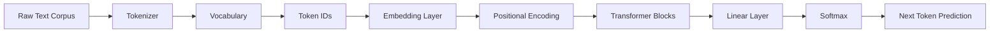
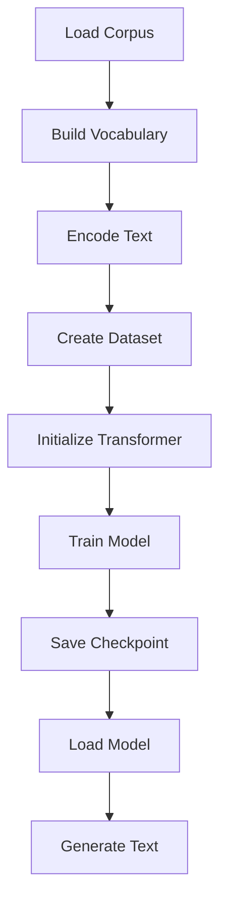
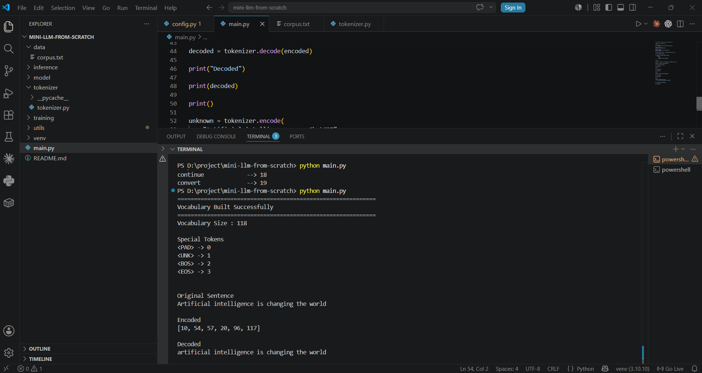
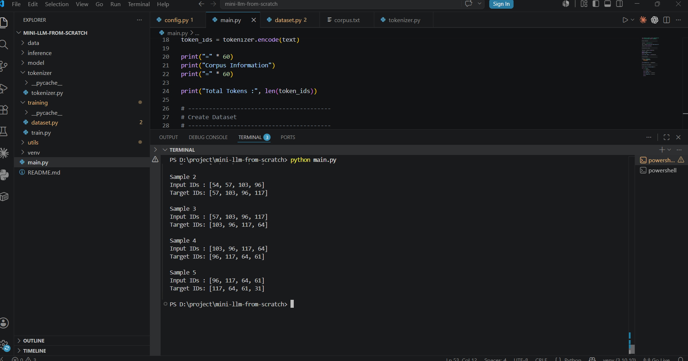
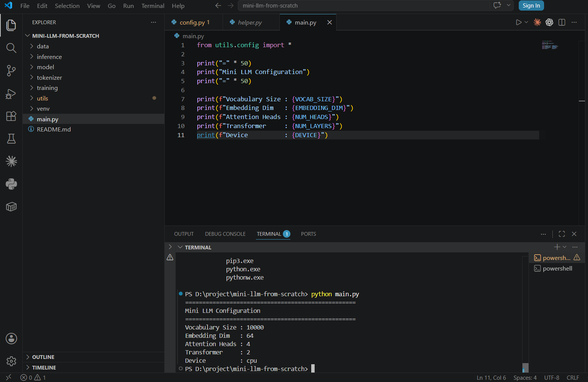
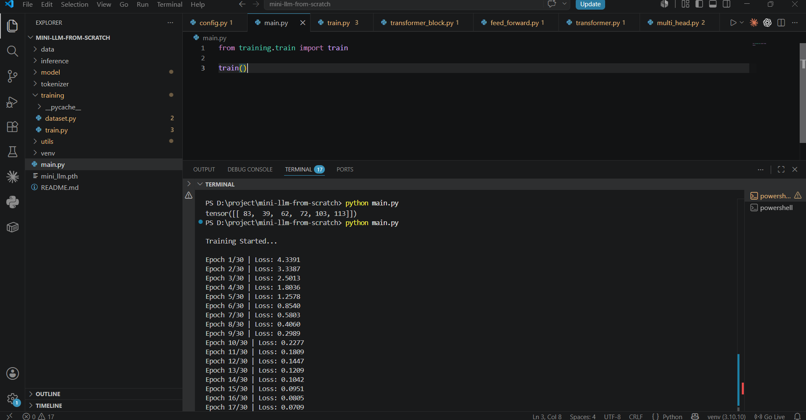
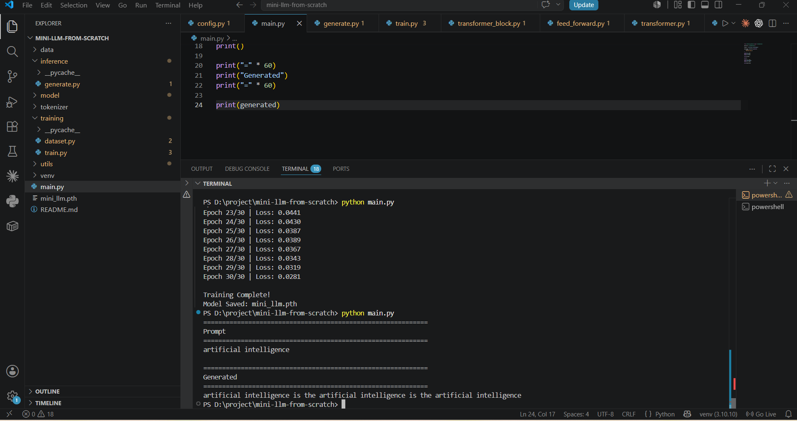
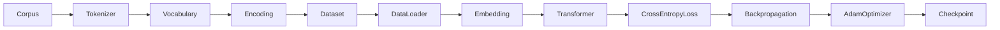
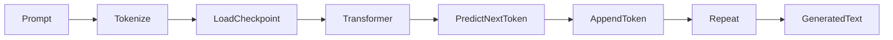

<!-- ========================================================= -->
<!--                        HERO SECTION                        -->
<!-- ========================================================= -->

<p align="center">


</p>

<h1 align="center">

🧠 Mini LLM From Scratch

</h1>

<h3 align="center">

Build • Train • Generate • Learn

</h3>

<p align="center">

A complete educational implementation of a <b>GPT-style Transformer Language Model</b><br>

built completely from scratch using <b>Python</b> and <b>PyTorch</b>.

</p>

---

<p align="center">

<a href="#-demo">


</a>

<a href="#-features">


</a>

<a href="#-installation">


</a>

<a href="#-screenshots">


</a>

</p>

---

<p align="center">


</p>

<p align="center">


</p>

---

# 🎬 Live Project Preview

> **A short preview of the complete training and inference pipeline.**

<p align="center">


</p>

> 📺 **Complete YouTube walkthrough will be added soon.**

---

# ⭐ Why This Project?

Most tutorials explain **what Transformers are**.

Very few explain **how to build one from scratch.**

This repository was created to bridge that gap.

Instead of relying on high-level libraries such as Hugging Face, this project implements the core components manually to provide a clear understanding of how GPT-style language models work internally.

The implementation focuses on **learning**, **clarity**, and **clean architecture**, making it suitable for students, beginners, and developers interested in understanding modern Natural Language Processing systems.

---

# 🚀 What You'll Learn

By exploring this repository, you'll understand how a Transformer-based language model works internally.

✔ Build a custom tokenizer

✔ Create a vocabulary from raw text

✔ Encode and decode text

✔ Prepare datasets for next-token prediction

✔ Implement embeddings

✔ Add positional encoding

✔ Build self-attention

✔ Implement multi-head attention

✔ Create transformer blocks

✔ Train a GPT-style language model

✔ Save checkpoints

✔ Generate text autoregressively

---

# ✨ Project Highlights

<table>

<tr>

<td width="33%" align="center">

🧠

### GPT-style Architecture

Complete Transformer implementation without external model libraries.

</td>

<td width="33%" align="center">

⚡

### PyTorch

Implemented using clean and modular PyTorch code.

</td>

<td width="33%" align="center">

🎓

### Educational

Designed to explain every important building block of modern LLMs.

</td>

</tr>

<tr>

<td align="center">

📚

### Beginner Friendly

Simple code structure with detailed documentation.

</td>

<td align="center">

🚀

### Resume Ready

Production-quality GitHub project suitable for portfolios.

</td>

<td align="center">

🛠

### Easily Extendable

Can be expanded with BPE, RoPE, Flash Attention, GPU training, and more.

</td>

</tr>

</table>

---

# 📑 Repository Navigation

| Section | Description |
|---------|-------------|
| 🎥 Demo | Project demonstration |
| ✨ Features | Major project capabilities |
| 🏗 Architecture | Internal Transformer design |
| ⚙️ Workflow | End-to-end pipeline |
| 📂 Folder Structure | Project organization |
| 🚀 Installation | Setup instructions |
| 💻 Usage | Training & Inference |
| 📸 Screenshots | Project walkthrough |
| 📊 Configuration | Hyperparameters |
| 🔮 Future Work | Planned improvements |
| 👨‍💻 Author | About the developer |

---

<!-- ========================================================= -->
<!--                 ARCHITECTURE & WORKFLOW                   -->
<!-- ========================================================= -->

# 🏗 Architecture

The Mini LLM follows the same high-level pipeline used by modern Transformer-based language models.



---

# ⚙️ Complete Workflow

The project is divided into small modular stages so each component can be understood independently.



---

# 🧩 Core Components

| Component | Purpose |
|-----------|---------|
| 🔤 Tokenizer | Converts raw text into numerical token IDs |
| 📚 Vocabulary Builder | Creates vocabulary from the corpus |
| 📄 Dataset | Generates input-target pairs |
| 🔢 Embedding Layer | Learns dense word representations |
| 📍 Positional Encoding | Preserves sequence order |
| 🎯 Self Attention | Learns contextual relationships |
| 👀 Multi-Head Attention | Captures multiple semantic patterns simultaneously |
| ⚡ Feed Forward Network | Improves feature representation |
| 🏗 Transformer Block | Combines Attention + FFN + LayerNorm |
| 💾 Checkpoint | Saves trained model weights |
| 💬 Inference | Generates text token-by-token |

---

# 📂 Project Structure

```text
Mini-LLM-From-Scratch/

├── assets/
│
├── checkpoints/
│
├── data/
│
├── tokenizer/
│
├── training/
│
├── model/
│
├── inference/
│
├── utils/
│
├── main.py
│
├── requirements.txt
│
└── README.md
```

---

# 📁 Folder Explanation

| Folder | Description |
|---------|-------------|
| assets | Images, GIFs, Banner & Documentation |
| checkpoints | Saved Model Weights |
| data | Training Corpus |
| tokenizer | Vocabulary Builder & Tokenizer |
| training | Dataset & Training Pipeline |
| model | Transformer Implementation |
| inference | Text Generation |
| utils | Configuration Files |
| main.py | Demo Programs |

---

# 📸 Project Walkthrough

The following screenshots show each stage of the complete pipeline.

---

<table>

<tr>

<td align="center" width="50%">

<b>📂 Project Structure</b>

<br><br>


</td>

<td align="center" width="50%">

<b>🔤 Vocabulary Building</b>

<br><br>



</td>

</tr>

<tr>

<td align="center">

<b>📊 Dataset Preparation</b>

<br><br>



</td>

<td align="center">

<b>⚙️ Model Configuration</b>

<br><br>



</td>

</tr>

<tr>

<td align="center">

<b>🚀 Training Started</b>

<br><br>



</td>

<td align="center">

<b>✅ Training Complete</b>

<br><br>


</td>

</tr>

<tr>

<td colspan="2" align="center">

<b>💬 Text Generation</b>

<br><br>



</td>

</tr>

</table>

---

# 📈 Training Pipeline



---

# 💬 Inference Pipeline



---

# 🎯 Design Principles

This project was designed with the following goals in mind.

- ✅ Clean and Modular Code
- ✅ Beginner Friendly
- ✅ Easy to Understand
- ✅ Well Documented
- ✅ Resume Ready
- ✅ Open Source
- ✅ Easy to Extend
- ✅ Educational Implementation

---

# 🧠 Skills Demonstrated

This repository demonstrates practical knowledge of:

- Python Programming
- PyTorch
- Neural Networks
- Transformer Architecture
- Self Attention
- Multi Head Attention
- Deep Learning
- Natural Language Processing
- Language Modeling
- Software Engineering
- Git & GitHub
- Documentation

---
<!-- ========================================================= -->
<!--                  INSTALLATION & USAGE                     -->
<!-- ========================================================= -->

# 🚀 Getting Started

Follow the steps below to set up and run the project on your local machine.

---

# 📋 Prerequisites

Before running the project, make sure the following software is installed.

| Software | Version |
|-----------|----------|
| Python | 3.10+ |
| Git | Latest |
| pip | Latest |
| VS Code *(Recommended)* | Latest |

Verify your installation.

```bash
python --version

pip --version
```

---

# 📥 Clone Repository

```bash
git clone https://github.com/ENAYATULLA/Mini-LLM-From-Scratch.git

cd Mini-LLM-From-Scratch
```

---

# 📦 Create Virtual Environment

### Windows

```bash
python -m venv venv

venv\Scripts\activate
```

### Linux / macOS

```bash
python3 -m venv venv

source venv/bin/activate
```

---

# 📚 Install Dependencies

```bash
pip install -r requirements.txt
```

---

# ▶ Running the Project

The complete pipeline can be executed in the following order.

| Step | Description |
|------|-------------|
| 1 | Build Vocabulary |
| 2 | Prepare Dataset |
| 3 | Configure Model |
| 4 | Train Model |
| 5 | Generate Text |

---

# 🔤 Step 1 — Build Vocabulary

Run

```bash
python main.py
```

Expected Output


The tokenizer scans the corpus, builds a vocabulary, assigns unique IDs to every token, and performs text encoding and decoding.

---

# 📊 Step 2 — Dataset Preparation

Run

```bash
python main.py
```

Expected Output


The dataset creates Input–Target pairs for next-token prediction using a sliding window approach.

---

# ⚙ Step 3 — Model Configuration

Run

```bash
python main.py
```

Expected Output


The configuration defines all model hyperparameters including embedding size, transformer layers, attention heads, sequence length, learning rate, and device.

---

# 🏋 Step 4 — Train the Model

Run

```bash
python -m training.train
```

Training Output


After successful training


The trained weights are automatically stored inside the **checkpoints/** directory.

---

# 💬 Step 5 — Generate Text

Run

```bash
python -m inference.generate
```

Example Prompt

```text
Artificial Intelligence
```

Example Output


The model predicts one token at a time using autoregressive next-token prediction.

---

# 📊 Current Model Configuration

| Hyperparameter | Value |
|---------------|------:|
| Architecture | GPT-style Transformer |
| Embedding Dimension | 64 |
| Attention Heads | 4 |
| Transformer Layers | 2 |
| Tokenizer | Word Level |
| Framework | PyTorch |
| Training | Next Token Prediction |
| Device | CPU |

---

# 📈 Learning Outcomes

This project demonstrates practical implementation of:

- GPT-style Language Models
- Transformer Architecture
- Word Embeddings
- Positional Encoding
- Self Attention
- Multi Head Attention
- Feed Forward Networks
- Layer Normalization
- Residual Connections
- Cross Entropy Loss
- Backpropagation
- Autoregressive Text Generation
- PyTorch Model Development
- Software Engineering Best Practices

---

# 🛣 Future Roadmap

The following improvements are planned.

- [ ] Byte Pair Encoding (BPE)
- [ ] SentencePiece Tokenizer
- [ ] Rotary Positional Embeddings (RoPE)
- [ ] Flash Attention
- [ ] GPU Training
- [ ] Mixed Precision Training
- [ ] Beam Search
- [ ] Top-k Sampling
- [ ] Top-p Sampling
- [ ] Temperature Sampling
- [ ] Streamlit Web Interface
- [ ] Hugging Face Integration
- [ ] Larger Training Dataset

---

# 🤝 Contributing

Contributions are always welcome.

If you'd like to improve this project:

```text
Fork Repository

↓

Create Feature Branch

↓

Commit Changes

↓

Push Branch

↓

Open Pull Request
```

---

# ⭐ Support

If this repository helped you learn something new,

please consider giving it a ⭐ on GitHub.

Your support motivates future improvements.

---

# 👨‍💻 About the Author

<table>

<tr>

<td width="170">


</td>

<td>

<h3>Enayat Ullah</h3>

B.Tech Computer Science Engineer

Passionate about

• Artificial Intelligence

• Machine Learning

• Deep Learning

• Natural Language Processing

• Large Language Models

• Python

• PyTorch

</td>

</tr>

</table>

---

# 🌐 Connect With Me

<p align="center">

<a href="https://github.com/ENAYATULLA">


</a>

<a href="https://www.linkedin.com/in/enayat-ullah-65a6a1252/">


</a>

<a href="https://enayat-ullah-portfolio.vercel.app/">


</a>

</p>

---

<p align="center">

## ⭐ If you found this project useful, consider giving it a star.

### Thank you for visiting the repository.

Made with ❤️ using Python & PyTorch

</p>
